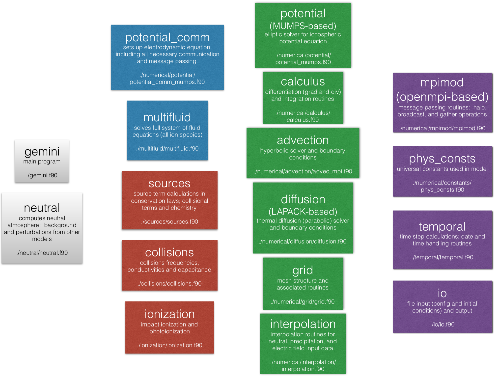
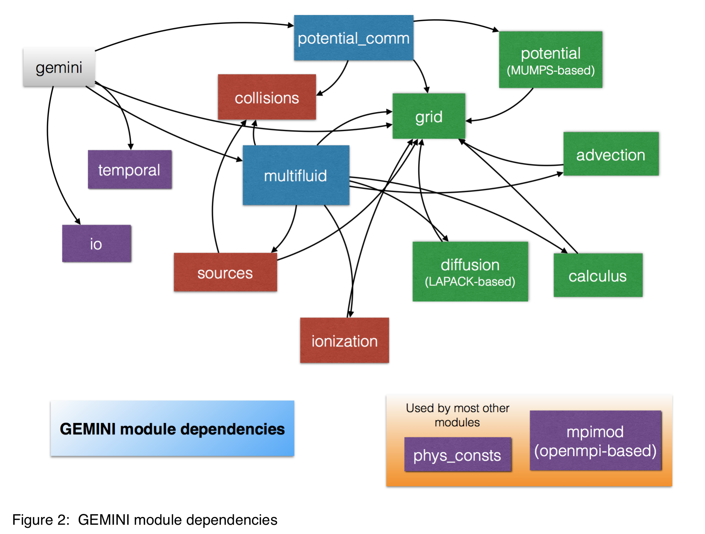

[](https://dev.azure.com/mhirsch0512/Gemini3D/_build/latest?definitionId=1&branchName=master)
[](https://www.travis-ci.com/gemini3d/GEMINI)
[](https://ci.appveyor.com/project/scivision/gemini-n1pxl)

# GEMINI

The GEMINI model (*G*eospace *E*nvironment *M*odel of *I*on-*N*eutral *I*nteractions) is a three-dimensional ionospheric fluid-electrodynamic model used for various scientific studies including effects of auroras on the terrestrial ionosphere, natural hazard effects on the space environment, and effects of ionospheric fluid instabilities on radio propagation (see references section of this document for details).  The detailed mathematical formulation of GEMINI is included in `doc/`.

A subroutine-level set of documentation describing functions of individual program units is given via [source code comments which are rendered as webpages](https://mattzett.github.io/gemini/index.html).

GEMINI uses generalized orthogonal curvilinear coordinates and has been tested with dipole and Cartesian coordinates.

We have prioritized ease of setup/install across a wide variety of computing systems.
Please open a [GitHub Issue](https://github.com/gemini3d/gemini/issues) if you experience difficulty building GEMINI.

Generally, the Git `master` branch has the current development version and is the best place to start, while more thoroughly-tested releases happen occasionally.  Specific commits corresponding to published results will also be noted, where appropriate, in the corresponding journal article.


## Prerequisites

The CMake build system is used to manage the large number of dependencies and external libraries needed to compile GEMINI.
If a newer CMake version is needed, CMake is easily installed in a minute *without* sudo/admin on:

* Linux: [cmake_setup.py](https://github.com/scivision/cmake-utils/blob/master/cmake_setup.py)
* MacOS: `brew install cmake`
* [Windows](https://cmake.org/download)

### Compilers

Compiler wrappers `mpifort` or `mpiifort` can be used.  Fortran 2008 `submodule` and other Fortran 2008 throughout GEMINI requires a Fortran 2008 compliant compiler.  Such compilers include:

* gfortran &ge; 6
* Intel `ifort`: all [currently supported versions](https://software.intel.com/en-us/articles/intel-parallel-studio-xe-supported-and-unsupported-product-versions)
* Cray `ftn`
* IBM XL


### Libraries

Tested versions include:

* OpenMPI 1.10, 2.1 - 4.0
* MUMPS 4.10, 5.1
* SCALAPACK 2.0
* LAPACK95 3.0  (optional)
* NCAR GLOW (optional)   enabled by `cmake -DUSEGLOW=yes ..` option

### postprocessing and visualization of model output

GEMINI `*.m` scripts require EITHER:

* GNU Octave &ge; 4.0:  Note that GNU Octave plotting is unreliable in general for any program. Matlab is recommended.
* Matlab &ge; R2007b

Note that only the essential scripts needed to setup a simple example, and plot the results are included in the main GEMINI respository.  A separate repository has been created for more involved examples.

### Document generation

The documentation is Markdown-based, using FORD. If source code or documentation edits are made, the documentation is regenerated from the top-level gemini directory by:
```sh
ford ford.md
```
The output is under `docs/` and upon `git push` will appear at the [GEMINI docs website](https://mattzett.github.io/gemini/index.html).

FORD is a Python program, installed via:
```sh
pip install ford
```

Note: leave the LaTeX files and other non-autogenerated documents in `doc/` so they don't get disturbed by FORD.

## License

GEMINI is distributed under the Affero GNU public license (aGPL) version 3+.


## Suggested hardware

GEMINI can run on hardware ranging from a modest laptop to a high-performance computing (HPC) cluster.

For large 3D simulations (more than 20M grid points), GEMINI should be run in a cluster environment or a "large" multicore workstation (e.g. 12 or more cores).  Runtime depends heavily on the grid spacing used, which determines the time step needed to insure stability,  For example we have found that a 20M grid point simulations takes about  4 hours on 72 Xeon E5 cores.  200M grid point simulations can take up to a week on 256 cores.  It has generally been found that acceptable performance requires > 1GB memory per core; moreover, a large amount of storage (hundreds of GB to several TB) is needed to store results from large simulations.

One could run large 2D or very small 3D simulations (not exceeding a few million grid points) on a quad-core workstation, but may take quite a while to complete.


## Quick start

This method is tested on CentOS and Ubuntu.
This test runs a short demo, taking about 2-5 minutes on a typical Mac / Linux laptop, from scratch.


1. get GEMINI code and install prereqs
   ```sh
   cd ~
   git clone https://github.com/gemini3d/gemini
   cd gemini
2. Generate Makefile and auto-download test reference data
   ```sh
   cmake -B build
3. compile
   ```sh
   cmake --build build --parallel
   ```
4. run GEMINI demo:
   ```
   cd build

   ctest --output-on-failure
   ```

If you get errors about libraries not found or it's using the wrong compiler, see the `build_.sh` scripts for examples of how to easily tell CMake to use custom library and compiler locations.

### input directory
The example `config.ini` in `initialize/` looks for input grid data in `../simulations`.
If you plan to push back to the repository, please don't edit those example `.ini` file paths, instead use softlinks `ln -s` to point somewhere else if needed.
Note that any `config.ini` you create yourself in `initialize/` will not be included in the repository since that directory is in `.gitignore` (viz. not tracked by git).

#### MUMPS verbosity
MUMPS initialization ICNTL flags are set in `numerical/potential/potential_mumps.f90`.
ICNTL 1-4 concern print output unit and verbosity level, see MUMPS
[User Manual](http://mumps.enseeiht.fr/index.php?page=doc)

#### Build tips

* If the CMake version that ships with your linux or MacOS distribution is too old, use [cmake_setup.sh](https://github.com/scivision/cmake-utils). Note that this script does NOT use `sudo`.

Libraries:

* If you have `sudo` access, try the `./install_prereqs.sh` script
* If need to build libraries from source (e.g. because you don't have `sudo`) try `build_gnu_noMKL.sh` or `build_intel.sh` from the `fortran-libs` repo:

  ```sh
  git clone https://github.com/scivision/fortran-libs ~/flibs-nomkl

  cd ~/flibs-nomkl

  ./build_gnu_noMKL.sh
  ```


### self-tests
GEMINI has self tests that compare the output from a "known" test problem to a reference output.  So running:

```sh
ctest --output-on-failure
```

Can be manually done from the top-level gemini/ directory by:

```sh
mpiexec -np 2 build/gemini.bin initialize/2Dtest/config.ini /tmp/2d
```

use GNU Octave (or Matlab) to compare with reference output using `tests/compare_all.m`:

```matlab
compare_all(/tmp/2d, '../simulations/2Dtest_files/2Dtest_output')
```

### OS-specific tips

#### Ubuntu
Tested on Ubuntu 18.04 / 16.04.

If you have sudo (admin) access:
```sh
./install_prereqs.sh
```
Otherwise, ask your IT admin to install the libraries or
[compile them yourself](https://github.com/scivision/fortran-libs)
or consider Linuxbrew.


#### CentOS
This is for CentOS 7, using "modules" for more recent libraries.
For the unavailable modules,
[compile them yourself](https://github.com/scivision/fortran-libs)
```sh
module load git cmake mumps scalapack openmpi lapack metis

module load gcc
export CC=gcc CXX=g++ FC=gfortran
```

Try to compile gemini as above, then
[build the missing libraries](https://github.com/scivision/fortran-libs).

Example:
```sh
cmake -DSCALAPACK_ROOT=~/flibs-nomkl/scalapack -DMUMPS_ROOT=~/flibs-nomkl/MUMPS ..
```

## Known limitations and issues of GEMINI

1. Generating equilibrium conditions can be a bit tricky with curvilinear grids.  A low-res run can be done, but it will not necessary interpolate properly onto a finer grid due to some issue with the way the grids are made with ghost cells etc.  A workaround is to use a slightly narrower (x2) grid in the high-res run (quarter of a degree seems to work most of the time).
2. Magnetic field calculations on an open 2D grid do not appear completely consistent with MATLAB model prototype results; although there are quite close.  This may have been related to sign errors in the FAC calculations - these tests should be retried at some point.
3. Occasionally MUMPS will throw an error because it underestimated the amount of memory needed for a solve.  If this happens a workaround is to uncomment (or add) this line of code to the potential solver being used for your simulations:
  ```fortran
  mumps_par%ICNTL(14)=50
  ```
  If the problem persists try changing the number to 100.
4. There are potentially some issues with the way the stability condition is evaluated, i.e. it is computed before the perp. drifts are solved so it is possible when using input data to overrun this especially if your target CFL number is &gt; 0.8 or so.  Some code has been added as of 8/20/2018 to throttle how much dt is allowed to change between time steps and this seems to completely fix this issue, but theoretically it could still happen; however this is probably very unlikely.
5. Occasionally one will see edge artifacts in either the field -aligned currents or other parameters for non-periodic in x3 solves.  This may be related to the divergence calculations needed for the parallel current (under EFL formulation) and for compression calculations in the multifluid module, but this needs to be investigated further...  This do not appear to affect solutions in the interior of the grid domain and can probably be safely ignored if your region of interest is sufficiently far from the boundary (which is alway good practice anyway).


## To do list

See [TODO.md](./TODO.md).

## Standard and style

GEMINI is Fortran 2008 compliant and uses two-space indents throughout (to accommodate the many, deeply nested loops).  Some of our developers are avid VIM users so please do not use tabs if you plan to push back to the repository or merge.


## To build and run GEMINI:

```sh
cmake -B build

cmake --build build --parallel

mpirun -np <number of processors>  build/gemini.bin <input config file> <output directory>
```
for example:
```sh
mpirun -np 4 build/gemini.bin initialize/2Dtest/config.ini ../simulations/2Dtest/
```

Note that the output *base* directory must already exist (`../simulations` in previous example).  The source code consists of about ten module source files encapsulating various functionalities used in the model.  A diagram all of the modules and their function is shown in figure 1; a list of module dependencies can also be found one of the example makefiles included in the repo or in CMakeList.txt.

Two of the log files created are:

* gitrev.log: the Git branch and hash revision at runtime (changed filenames beyond this revision are logged)
* compiler.log: compiler name, version and options used to compile the executable.




<!--  -->

##Auxiliary fortran program

Note that there is also a utility that can compute magnetic fields from the currents calculated by GEMINI.  This can be run by:
```sh
mpirun -np 4 ./magcalc ../simulations/3Dtest/ ../simulations/input/3Dtest/magfieldpoints.dat
```
This will compute magnetic fields over a grid at ground level using currents computed from the 3Dtest simulation.  In order to run this program, you will need to create a set of field points at which the magnetic perturbations will be calculated.  For example, this could be a list of ground stations, a regular mesh, or a set of satellite tracks.

## Verifying GEMINI build

Assuming you have built by
```sh
cmake -B build

cmake --build build --parallel
```

then change to the build directory to run CTest:
```sh
cd build
```

* run all self tests:
  ```sh
  ctest --output-on-failure
  ```

Select particular tests using `ctest -R <regexp>`.

* run 2D tests:
  ```sh
  ctest -R 2D --output-on-failure
  ```
* run 3D tests:
  ```sh
  ctest -R 3D --output-on-failure
  ```

Exclude particular tests using `ctest -E <regexp>`.

* run all except 2D tests:
  ```sh
  ctest -E 2D --output-on-failure
  ```
* run all except 3D tests:
  ```sh
  ctest -E 3D --output-on-failure
  ```

The maximum number of MPI processes is set with `cmake -DNP=`.
For example to request 4 MPI processes from the build/ directory:
```sh
cmake -DNP=4 ..

cmake --build . -j

ctest
```
Otherwise, the default (suggested) CMake generation process automatically sets the maximum number of processes possible based on your CPU core count and grid size.

Full debugging and testing is enabled from the build/ directory by:
```sh
cmake -DCMAKE_BUILD_TYPE=Debug ..

cmake --build -j .

ctest --output-on-failure
```

## Input file format

Each simulation needs an input file that specifies location of initial conditions and other pertinent information for the simulation.  A coupled of very basic examples of these are included in the ./initialize directory; each subdirectory is a separate example usage of GEMINI for a particular problem.  The basic template for an input file (config.ini) file follows (please note that most use cases will not have all options activated as this example does).
```
16,9,2015                             !dmy:  day,month,year
82473.0                               !UTsec0:  start time, UT seconds
1800.0                                !tdur:  duration of simulation in seconds
15.0                                  !dtout: how often (s) to do output
109.0,109.0,5.0                       !activ:  f107a,f107,Ap (81 day averaged f10.7, daily f10.7, and average Ap index)
0.9                                   !tcfl:  target cfl number (dimensionless - must be less than 1.0 to insure stability)
1500.0                                !Teinf:  exospheric electron temperature, K (only used in open-grid simulations)
0                             	  !potsolve:  are we solving potential? (0=no; 1=-yes)
0                                     !flagperiodic:  do we interpret the grid as being periodic in the x3-direction?  (0=no; 1=yes)
2                                     !flagoutput:  what type of output do we do?  (2=ISR-like species-averaged plasma parameters; 3=electron density only; anything else nonzero=full output)
0                                     !flagcapacitance:  include inertial capacitance? (0=no; 1=yes; 2=yes+m'spheric contribution)
../simulations/input/chile20153D_0.5_medhighres/chile20153D_0.5_medhighres_simsize.dat
../simulations/input/chile20153D_0.5_medhighres/chile20153D_0.5_medhighres_simgrid.dat
../simulations/input/chile20153D_0.5_medhighres/chile20153D_0.5_medhighres_ICs.dat
1                                     !are we applying neutral perturbations? (0=no; 1=yes).  If 0, the next five entries are skipped while reading this input file
1                                     !how doe we interpret the input neutral file geometry?  (0=Cartesian; anything else=axisymmetric)
-20.5706d0,359.4048d0                 !source mlat,mlon of disturbance (degrees magnetic lat,lon)
4d0                                   !time step between neutral input files
2d3,2d3                               !spatial resolutions in radial and vertical directions
../simulations/chile2015_neutrals/
1                                     !flagprecfileinput:  for precipitation file input (0=no; 1=yes).  If 0, then next two entries of input file are skipped
1.0                                   !dtprec:  time (s) between precipitation input files
../simulations/isinglass_precipitation/
1                                     !flagE0fileinput:  flag for electric field file input (0-no; 1=yes).  If 0, next two entries of input file are skipped
10.0                                  !dtE0:  time (s) between electric field input files
../simulations/isinglass_fields/
```

A large number of examples (in addition to those included in the main repo) are included in the GEMINI-script repository.


## Running with different boundary and initial conditions:

GEMINI requires both initial and boundary conditions to run properly.  Specifically the user must provide a complete initial ionospheric state (density, drift, and temperature for all ionospheric species), along with boundary conditions for the electric potential (in 2D this are the top, bottom, and side potentials; in 3D the topside current density and side wave potentials).  Fluid state variables are given free-flow boundary conditions at the edges of the simulation grid.  The `io` module contains code dealing with input of initial state from file and the `potential_comm` and `potentialBCs_mumps` modules contains contains code dealing with boundary condition input.

There are presently two ways in which the boundary and initial conditions can be set for GEMINI:  subroutine-based input and file-based input.

PLEASE NOTE that future releases will use Fortran 2008 `submodule`, likely completely removing the option for subroutine-based initial and boundary conditions.

### Subroutine-based input (*not recommended* and to be deprecated in a future release):

There are two subroutines that can be modified by the user to provide boundary conditions to the code; these are described below. Note that, if any of these are changed, the code needs to be recompiled.

`./ionization/boundary_conditions/precipBCs_mod.f90` - the function `precipBCs' specifies the pattern of electron precipitation, including characteristic energy and total energy flux, over top of grid.  If the user does not specify an input file for precipitation boundary conditions in `config.ini`, then this subroutine will be called to set the boundary.

`./numerical/potential/boundary_conditions/potentialBCs_mumps.f90` - boundary conditions for the electric potential or field-aligned current.  The type of input that is being used is specified by the flags in the `config.ini` file for the simulation.  This subroutine will only be called if the user has not specified an input file containing boundary conditions.

By default these subroutines will be used for boundary conditions if file input is not specified in the config.ini input file.  The base GEMINI sets these to be zero potential (or current) and some negligible amount of precipitation.  Note that if you write over these subroutines then the code will use whatever you have put into them if file input is not specified.  This can lead to unintended behavior if ones modifies these and then forgets since the code will continue to use the modifications instead of some baseline.  Because of this issue, and the fact that GEMINI must be rebuilt every time these subroutines are changed, this method of boudnary condition input is going to be removed.

### File-based input (*recommended*)

An alternative is to use the file input option, which needs to be set up using MATLAB (or other) scripts.  To enable this type of input, the appropriate flags (flagprecfileinput and flagE0fileinput) need to be set in the input `config.ini` file (see Section entitled "Input file format" above).  All examples included in `initialize/` in both the GEMINI and GEMINI-scripts repositories use this method for setting boundary conditions.  Note that the user can specify the boundary condition on a different grid from what the simulation is to be run with; in this case GEMINI will just interpolate the given boundary data onto the current simulation grid.

### Initial conditions

GEMINI needs density, drift, and temperature for each species that it simulations over the entire grid for which the simulation is being run as input.  Generally one will use the results of another GEMINI simulation that has been initialized in an arbitrary way but run for a full day to a proper ionospheric equilibrium as this input.  Any equilibrium simulation run this way must use full output (flagoutput=1 in the `config.ini`).  A useful approach for these equilibrium runs is to use a coarser grid so that the simulation completes quickly and then interpolate the results up to fine grid resolution.  An example of an equilibrium setup is given in `./initialize/2Dtest_eq`; note that this basically makes up an initial conditions (using `eqICs.m`) and runs until initial transients have settled.  An example of a script that interpolates the output of an equilibrium run to a finer grid is included with `./initialize/2Dtest`.


## Running one of the premade examples:

Currently the main repo only includes the very basic 2Dtest and 3Dtest examples


## Creating a simulation

1)  Create initial conditions for equilibrium simulation -  Several examples of equilibrium setups are included in the ./initialize directory; these end with `_eq`.  These are all based off of the general scripts `./setup/model_setup.m` and related scripts.  In general this equilbrium simulation will set the date, location, and geomagnetic conditions for the background ionospheric state for later perturbation simulations.
2)  Run an equilibrium simulation at low resolution to obtain a background ionosphere.  See examples in ./initialize ending in `_eq`
3)  Generate a grid - Several examples of grid generation scripts adapted to particular problems are given in the `initialize/` directory of the repo (see list above for an example).  In particular, for 2Dtest and 3Dtest there is a script that reads in an equilbirum simulation, creates a fine resolution mesh, and then interpolates the equilibrium data onto that fine mesh.
4)  Interpolate the equilibrium results on to a high resolution grid and create new input files for full resolution - See examples in the ./initialize/ directories not ending in `_eq`.  These are all based off of the general `./setup/model_setup_interp.m` script.
5)  Set up boundary conditions for potential, if required - see section of this document on boundary conditions
6)  Set up precipitation boundary conditions, if required -  see section of this document on boundary conditions
7)  Recompile the code with make *only if you are using subroutine based input and boundary conditions* (please note that this functionality will be removed in a later release).  If you are using file-based input then a rebuild is not necessary (this is another benefit of using file-based input)
8)  Run your new simulation


## Running in two dimensions

The code determines 2D vs. 3D runs by the number of x2 or x3 grid points specified in the `config.ini` input file.  If the number of x2 grid points is 1, then a 2D run is executed (since message passing in the x3 direction will work normally).  If the number of x3 grid points is 1, the simulation will swap array dimensions and vector components between the x2 and x3 directions so that message passing parallelization still provides performance benefits.  The data will be swapped again before output so that the output files are structured normally and the user who is not modifying the source code need not concern themselves with this reordering.


## Loading and plotting output

MATLAB is required to load the output file via scripts in the ./vis directory (these scripts generally work on both 2D and 3D simulation results).
GNU Octave is not reliable at plotting for any program, and might not work.
The results for an entire simulation can be plotted using [plotall.m](./vis/plotall.m)

```matlab
plotall('/tmp/mysim')
```

These also illustrates how to read in a sequence of files from a simulation.  This script prints a copy of the output plots into the simulation output directory.  Finer-level output control can be achieve by using the 'plotframe.m' and 'loadframe.m' scripts to plot and load data from individual simulation output frames, respectively.

The particular format of the output files is specified by the user in the input config.ini file.  There are three options:
1)  full output - output all state variables; very large file sizes will results, but this is required for building initial conditions and for some analysis that require detailed composition and temperature information.
2)  average state parameter output - species averaged temperature and velocity; electron density.  Probably best for most uses
3)  density only output - only electron density output.  Best for high-res instability runs where only the density is needed and the output cadence is high

The organization of the data in the MATLAB/octave workspace, after a single frame is loaded (via 'loadframe.m'), is as follows (MKSA units throughout):

### Time variables:

simdate - a six element vector containing year, month, day, UT hour, UT minute, and UT seconds of the present frame

### Grid variables:

<!--x1,x2,x3 - x1 is altitude (z in plots), x2 is east (x in plots), x3 north (y in plots); the sizes of these variables are stored in lxs by the MATLAB script.-->

structure xg - members xg.x1,2,3 are the position variables, `xg.h*` are the metric factors, `xg.dx*` are the finite differences,

xg.glat,glon are the latitudes and longitudes (degrees geographic) of each grid point, xg.alt is the altitude of each grid point.

xg.r,theta,phi - for each grid point:  radial distance (from ctr of Earth), magnetic colatitude (rads.), and magnetic longitude (rads.)

The grid structure, by itself, can be read in by the MATLAB function 'readgrid.m'; this is automatically invoked with 'loadframe.m' so there is not need to separately load the grid and output frame data.

### Temperature variable:

Ts (first three dimensions have size lxs; 4th dimension is species index:  1=O+,2=NO+,3=N2+,4=O2+,5=N+, 6=H+,7=e-)

### Density variable:

ns (same indexing as temperature)

### Drifts:

vs1 (same indexing as temperature)

x2-drift component:  v2 (same for all species, so this is just size lxs and is a 3D array)
x3-drift component:  v3

### Electromagnetic variables:

current density:  J1, J2, J3
potential:  Phitop (EFL potential)

Note that the electric field is not included in the output file, but that it can be calculated from this output by taking -vxB at an altitude above about 200 km or by differentiating the top boundary electric potential 'Phitop' with respect to the x2 and x3 variables; however, note that if a curvilinear grid is used the derivatives must include the appropriate metric factors.


## Computing total electron content (TEC)

TEC and magnetic field variations can be calculated as a post-processing step in which the simulation data are read in and interpolated onto a regular geographic grid and then integrated accordingly using scripts in the './vis' directory - see `TECcalc.m`.  An example of how to plot TEC computed by this script is included in `TECplot_map.m` (requires MATLAB mapping toolbox).


## Visualizing magnetic field perturbations computed by magcalc.f90

The example script `magplot_fort_map.m` shows an example of how to load the results of running magcalc.

