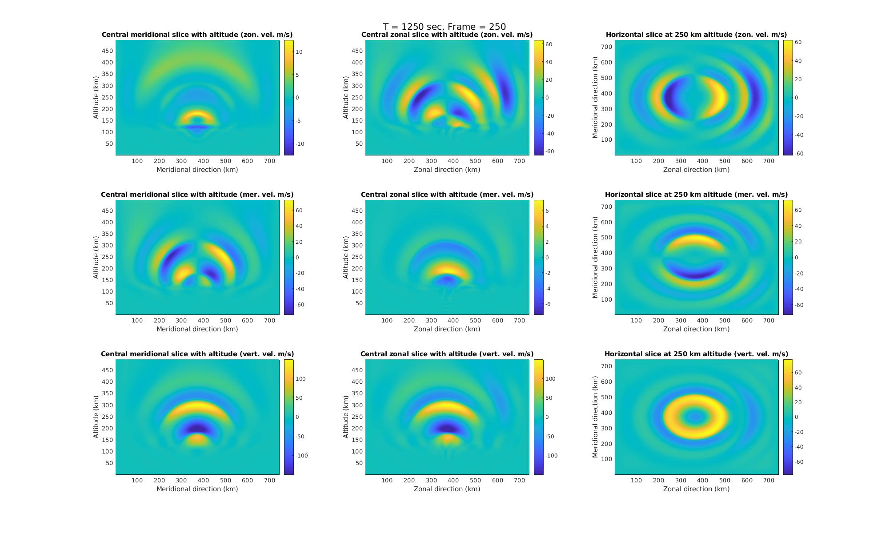
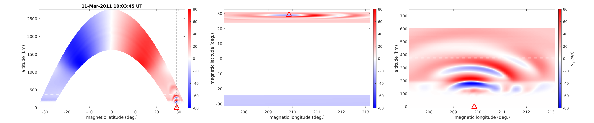
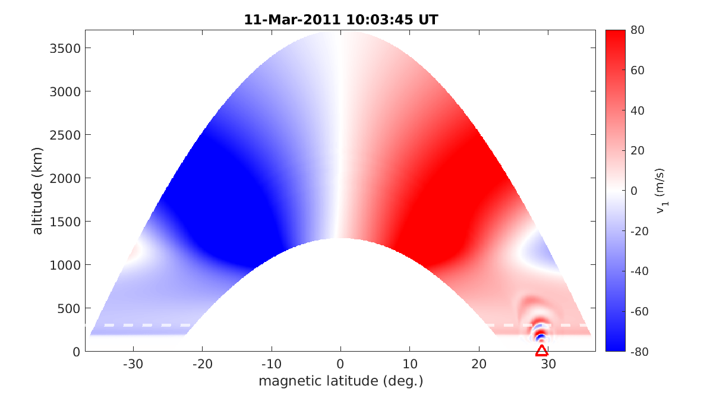
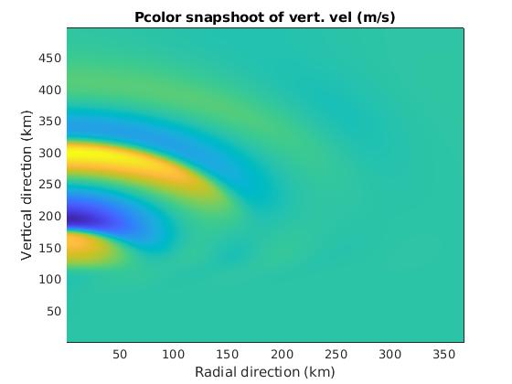
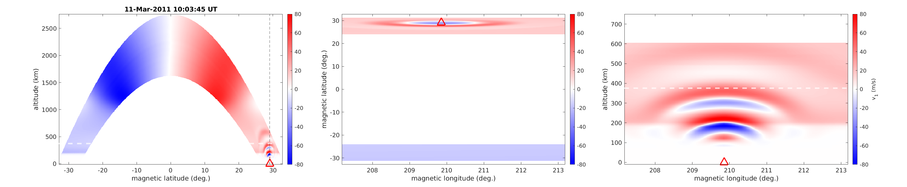

# Test MAGIC-GEMINI runs

This section discussed ways to create MAGIC (neutral gas fluctuations) inputs and use then in GEMINI simulations:

1. [MAGIC simulation description](#magic_description)
2. [3D Dipole GEMINI simulation with 3D Cartesian MAGIC input](#3d_dipole_3d_neutral)
3. [2D Dipole GEMINI simulation with 2D Cartesian MAGIC input](#2d_dipole_2d_neutral)
4. [2D/3D Dipole GEMINI simulations with 2D Axisymmetric MAGIC input](#3d_dipole_2daxi_neutral)

<a name="magic_description"></a>
## 1. MAGIC simulation description

Neutral atmospheric model MAGIC simulations is run with next configuration:

1. Type of the domain: 3D Cartesian;
2. Physical domain size: 750 x 750 x 500 km (meridional x zonal x vertical);
3. Numerical domain size: 90 x 80 x 100 points (in meridional x zonal x vertical directions);
4. Resolution: 8333.3 x 9375.0 x 5000 m (in meridional x zonal x vertical directions);
5. Simulation time: 1800 sec with 5 sec time step for output.

Main specification of the simulations:

```
90              mx          = cells in x direction
80              my          = cells in y direction
100             mz          = cells in z direction
360             nout        = number of output times to print results
1               outstyle    = style of specifying output times
1800            tfinal      = final time
1               dtv(1)	  = initial dt (used in all steps if method(1)=0)
0.0d0           t0          = initial time
-3.75d5         xlower	 = left edge of computational domain
3.75d5          xupper      = right edge of computational domain
-3.75d5         ylower	 = bottom edge of computational domain
3.75d5          yupper	= top edge of computational domain
0.0d0           zlower      = front edge of computational domain
5.0d5           zupper      = back edge of computational domain
```

The initial disturbance represent a slightly moving (in zonal direction from the center of the domain) axisymmetric source:

```
 1        forcemth     = 0 for no source, 1 for one, 2 for 'source.data' file
 0.035    omega	= forcing frequency
 1.5	   amplitude    = forcing magnitude (m/s or kg*m/s^2)
 0	      propx        = horizontal-x propagation constant
 2d-4	   propy        = horizontal-y propagation constant
 0        xpos         = x-axis position of oscillator
 0        ypos         = y-axis position of oscillator
 0        zpos         = z-axis position of oscillator
 2d4	   xwidth	= x-streamwise "width" of gaussian envelope
 2d4	   ywidth	= y-spanwise "width" of gaussian envelope
 2e3	   zwidth	= x-vertical "height" of gaussian envelope
 180	   tcenter      = peak forcing time (center of gaussian packet)
 180	   twidth	= temporal "width" of gaussian envelope
 0        vsrcx        = x-axis oscillator velocity
```

Simulation outputs are stored in HDF5 files separately for each time step (the data is storeg [here](https://www.dropbox.com/sh/fbgu7hjwewo4ol7/AABqEpMdqu7ZfAJSYtIHbPcUa?dl=0). The animation of fluid dynamics in 3 direction is [here](https://www.dropbox.com/s/pt4lqavc717a90a/MAGIC-movie.mp4?dl=0) and can be replicated using [animation.m](https://www.dropbox.com/s/pt4lqavc717a90a/MAGIC-movie.mp4?dl=0) from the MAGIC simulation folder:



<a name="3d_dipole_3d_neutral"></a>
## 2. 3D Dipole GEMINI simulation with 3D Cartesian MAGIC input

To prepare GEMINI neutral inputs, run Matlab script ``initialize3DCARD.m`` (``readandoutput3DCART.m`` required).
GEMINI neutral input requires the specification of simulation initial time (UT), time step (sec) and grid structure, as shown below:

```
% Initial time of GEMINI simulation and time step of neutral inputs
ymd0=[2011,3,11];
UTsec0=35100.0+5*Frame;
dtneu=5;

% Specify input data
lt=361; % number of time steps
lx1=80; % number of points in zonal direction
lx2=90; % number of points in meridional direction
lx3=100; % number of points in vertical direction
```

Note, that here ``lx1`` is zonal, ``lx2`` - meridional, and ``lx3`` - vertical directions, whereas the structure of matrix to be saved as GEMINI neutral input is ``[vertical,zonal,meridional]``. Matrix permutation should be done accordingly in case of need.



<a name="2d_dipole_2d_neutral"></a>
## 3. 2D Dipole GEMINI simulation with 2D Cartesian MAGIC input

To prepare GEMINI neutral inputs, run Matlab script ``initialize3DCARD.m`` (``readandoutput3DCART.m`` required).
GEMINI neutral input requires the specification of simulation initial time (UT), time step (sec) and grid structure, as shown below:

```
% Initial time of GEMINI simulation and time step of neutral inputs
ymd0=[2011,3,11];
UTsec0=35100.0+5*Frame;
dtneu=5;

% Specify input data
lt=361; % number of time steps
lx1=90; % latitude
lx2=100; % altitude
```

Note, that here ``lx1`` is meridional, and ``lx2`` - vertical directions, whereas the structure of matrix to be saved as GEMINI neutral input is ``[vertical,meridional]``. Matrix permutation should be done accordingly in case of need.



<a name="3d_dipole_2daxi_neutral"></a>
## 4. 2D/3D Dipole GEMINI simulation with 2D Axisymmetric MAGIC input

To prepare GEMINI neutral inputs, run Matlab script ``initialize3DCARD.m`` (``readandoutput3DCART.m`` required).
GEMINI neutral input requires the specification of simulation initial time (UT), time step (sec) and grid structure, as shown below:

```
% Initial time of GEMINI simulation and time step of neutral inputs
ymd0=[2011,3,11];
UTsec0=35100.0+5*Frame;
dtneu=5;

% Specify input data
lt=361; % number of time steps
lx1=45; % radial direction
lx2=100; % upward direction
```

Note, that here ``lx1`` is a radial, and ``lx2`` - vertical directions, whereas the structure of matrix to be saved as GEMINI neutral input is ``[vertical,radial]``. Matrix permutation should be done accordingly in case of need. Be sure that point 1 of matric is radial direction corresponds to the r=0. For reference, below is a snapshot from MAGIC neutral matrix ready to output into GEMINI neutral file of vertical fluid velocity ``pcolor(velzfull)``):




The same input can be used for both 2D and 3D GEMINI simulations.

2D Dipole GEMINI simulation:


3D Dipole GEMINI simulation:
